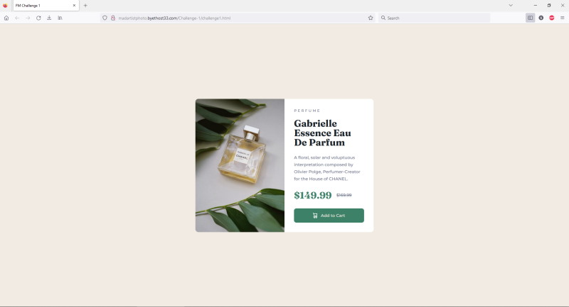

# Frontend Mentor - Product preview card component solution

This is a solution to the [Product preview card component challenge on Frontend Mentor](https://www.frontendmentor.io/challenges/product-preview-card-component-GO7UmttRfa). Frontend Mentor challenges help you improve your coding skills by building realistic projects. 

## Table of contents

- [Overview](#overview)
  - [The challenge](#the-challenge)
  - [Screenshot](#screenshot)
  - [Links](#links)
- [My process](#my-process)
  - [Built with](#built-with)
  - [What I learned](#what-i-learned)
  - [Continued development](#continued-development)
  - [Useful resources](#useful-resources)
- [Author](#author)
- [Acknowledgments](#acknowledgments)

## Overview

### The challenge

Users should be able to:  
- View the optimal layout depending on their device's screen size
- See hover and focus states for interactive elements

I have a Desktop, ipad, and cellphone. It shows on the desktop screen nicely. It shows Landscape orientation in both Landscape and Portrait orientation on the ipad. It shows fine in Portrait orientation on the phone, but displays in Portrait even when the phone is in Landscape orientation. Gotta work on that.

### Screenshot

### Links

- Solution URL: [(https://madartistphoto.github.io/FM-Challenge-1/))]

## My process

### Built with

- VSCode
- a bit of Notepad++

### What I learned

Okay, This is the first time I tried this. I learned...

- That I have a lot more to learn *
- Chasing down typing, punctuation, coding errors is a challenge
- Using vw and vh for responsive measurements
- How to include Google Fonts
- How to really mess it up and start over from scratch
- Learned about VSCode, though I have only scratched the surface of its power.
- Learned about Git, GitHub, and GitHub Pages. Now have a basic understanding of them. But need to use some reference material (ie:websites, videos) often
- Learned about about Markdown and README pages. I'm not much of a journal keeper, but I can see how doing this can be a good way to track my progress and direction

### Continued development

- See the first comment above *

